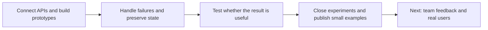

# Daan Klein — Building with AI, learning through evidence

I am a self-taught developer in the Netherlands, looking for an entry-level
role in automation, applied AI, software testing or API integration. I work
with Python and TypeScript, with substantial help from AI coding tools.

This is a working journal of my projects: the problems I pursued, the software
that resulted, the mistakes worth keeping, and where each piece of work stops.
Two small Python examples are included so you can inspect and run the work.

## Start here

| If you have… | Read or try… |
| --- | --- |
| Two minutes | [My journey](journal/README.md) and [strengths and learning goals](docs/skills-and-next-steps.md) |
| Ten minutes | [CatalogCue](projects/catalogcue/README.md): noisy observations and failed notifications |
| Time for a code review | [Quality-gate source](demos/llm-quality-gate/quality_gate.py), [monitoring source](projects/catalogcue/storewatch.py) and their tests |
| An interview to prepare | [How I work with AI](docs/how-i-work.md) and [application profile](docs/application-profile.md) |

## The route so far



This is the learning sequence; several projects overlapped. The
[journal](journal/README.md) identifies the dates supported by retained evidence.

## Work you can inspect

| Project | What it shows | Where this track ends |
| --- | --- | --- |
| [CatalogCue](projects/catalogcue/README.md) | Python, HTTP, parsing, state transitions and retries | Runnable sample; wider customer product unfinished |
| [LLM quality gate](demos/llm-quality-gate/README.md) | Explicit rules, JSONL, CLI exit codes and tests | Completed small deterministic demo |
| [AI marketplace](projects/ai-marketplace/README.md) | Typed application design, auth, billing and MCP exploration | Documented prototype with specific unfinished paths |
| [Decision systems](projects/decision-systems/README.md) | Data quality, time-correct experiments and negative results | Research case study; no proven profitable strategy |
| [Prediction-market automation](projects/prediction-market-automation/README.md) | API adapters, order lifecycle and reconciliation concepts | Historical source study; no public performance claim |

The [project register](docs/project-status.md) defines each endpoint and the
remaining work. Closing research is a deliverable when it leaves a clear answer
and useful evidence.

## Run the public examples

From the repository root, with Python 3.11 or newer:

```bash
python3 demos/llm-quality-gate/quality_gate.py demos/llm-quality-gate/examples/responses.jsonl --report-only
python3 projects/catalogcue/demo.py
python3 scripts/verify.py
```

The example report contains two passing cases and one deliberately failing
case. The CatalogCue walkthrough shows an unstable price, a confirmed change
and a failed notification being retried. These commands need no API account.
Monitoring tests and the walkthrough simulate network calls and notifications.
The verification command runs both test suites, checks example outcomes and
exit codes, and checks local documentation links.

**Verified locally and on GitHub: 13 September 2026 — 6 quality-gate tests and 19
monitoring tests passed.** Hosted checks passed on Python 3.11, 3.12 and 3.13.
[View the test run](https://github.com/jamestraimbler-lgtm/applied-ai-portfolio/actions/runs/34753343486).
[Evidence and limits](docs/evidence.md).

## What I want to contribute

I want to take a defined problem, build a small solution, make failures visible
and improve it through review. These examples give a team something concrete
to discuss with me. My next step is doing that with experienced colleagues and
real users.

Languages: Dutch, English and conversational French. [Application profile](docs/application-profile.md).
