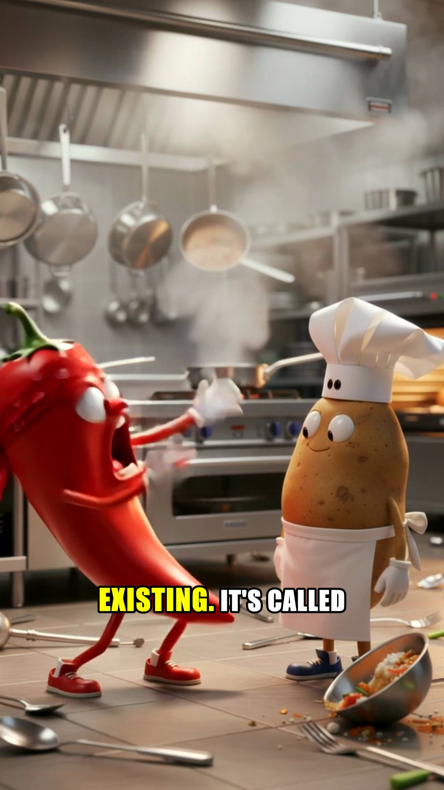

# Veggie Kitchen — an AI media workflow with a finished episode

**Endpoint: one finished episode; the wider series pipeline is an archived
prototype.** This personal project connects scripting, image generation,
animation, voices, captions and video assembly. It shows another side of my
work: learning creative tools and integrating them into a repeatable process.

The archive was inspected on 14 September 2026. The completed render and its
source assets are retained separately and can be shown in a walkthrough.
This repository contains a preview frame, the case study and the
[archived pipeline source](source/README.md).

## A concrete result

The retained episode-one export is **117.259 seconds**, **1080 × 1920**,
**30 fps**, with H.264 video and AAC audio. Associated assets include 14 scene
images, 14 animated clips, 14 dialogue audio files and 14 subtitle files.
A separate export without background music records an earlier assembly stage.

Metadata was checked with FFprobe. Three inspected frames show a cartoon
kitchen, consistent character styling and outlined captions with active-word
highlighting. Full audio quality, timing and lip synchronization were not
reviewed in this audit.

Preview from the retained episode-one render, approximately 60 seconds in.

## How the workflow fits together

| Stage | Source and retained evidence |
| --- | --- |
| Structured story | Scene JSON with dialogue, image and motion prompts; story context tracks characters, prior events and plot threads |
| Image generation | Fal image-generation calls, saved scene images, retry handling and reuse of completed outputs |
| Animation | Kling image-to-video through Fal with per-scene motion prompts and saved clips |
| Voices | ElevenLabs through Fal with character voice mapping and retained dialogue audio |
| Caption timing | Whisper word timestamps and generated ASS subtitles |
| Assembly | FFmpeg scene rendering, captions, transitions, concatenation and background-audio mixing |

The inspected script generator uses GPT-4o. These are technologies visible in
the retained code and assets; the audit does not establish that the latest
revision of every script produced every retained asset.

## What this demonstrates

- Breaking a creative output into connected production stages.
- Handling structured prompts and reusable story context.
- Combining several providers and file formats into one final artifact.
- Preserving intermediate outputs so individual stages can be inspected or
  repeated without starting the entire process again.

The work was substantially AI-assisted, as described in [how I work](../../docs/how-i-work.md).
It is a concrete example to discuss learning across unfamiliar tools, checking
intermediate results and following a workflow through to an export.

## Scope and limitations

Episode two has partial images and clips, but no final render or voice set in
the inspected archive. No current-provider run, clean installation or automated
upload was performed. Publication, audience growth, revenue and advertising
results were not verified.

This is entertainment content. Applying the workflow to a commercial brief
would add brand requirements, product accuracy, client feedback and acceptance
criteria. Experience with this stack does not imply experience with every
video-generation or professional editing tool.

## End of track

**Preserve the completed first episode and document the pipeline.** A future
return should start with one brief and a definition of done, then refresh and
test only the required production stages. The archive is not presented as a
finished content business or an actively maintained application.

[Project register](../../docs/project-status.md) · [Learning journal](../../journal/README.md) · [Portfolio](../../README.en.md)
